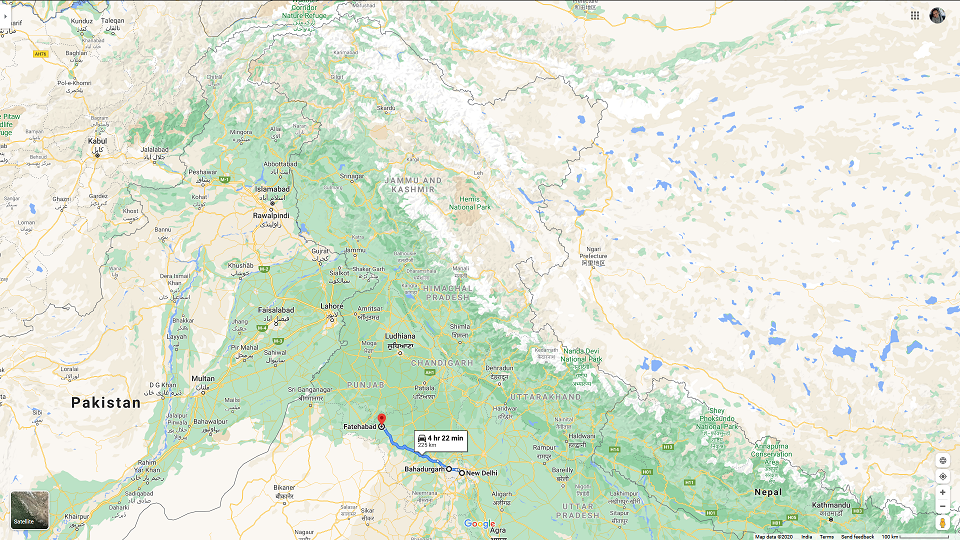

 
I am a technology professional based in New Delhi, India deeply interested in  playing & watching various sports, food and technology.

A person is but a product of his environment and experiences. Needless, I am no different. I was born in a family of primarily farmers & small businessmen (though my father is a doctor) based in a small town not too far north-west of Delhi - Fatehabad in the state of Haryana. 

This town, and generally this region, is part of the larger plains which hosted the Green Revolution that occurred in India a few decades ago which brought about quite a few revolutionally changes to how agriculture was done & perceived at time as well as to the lives of the people involved in it. Needless to say, agriculture is still the primary industry in the region even today. Here is a picture to help you locate this place -
 
 

 

Having studies science as my primary subject in school and done my Masters in Computer Applications, I have been working in the IT industry since 2003. I am a practicing IT Architect and have been involved in designing and implementing some interesting projects over the years.

I have travelled to various parts of the country and seen diverse landscape from oceans to mountains to desert to jungles. Have visited about half a dozen other countries for work - for short or long term and enjoyed exploring their land and culture too.

Here is my presence elsewhere on the internet where I express myself -

[Github home](https://www.github.com/anuragsetia)

[Tweets by Anuragsetia](https://twitter.com/Anuragsetia)
